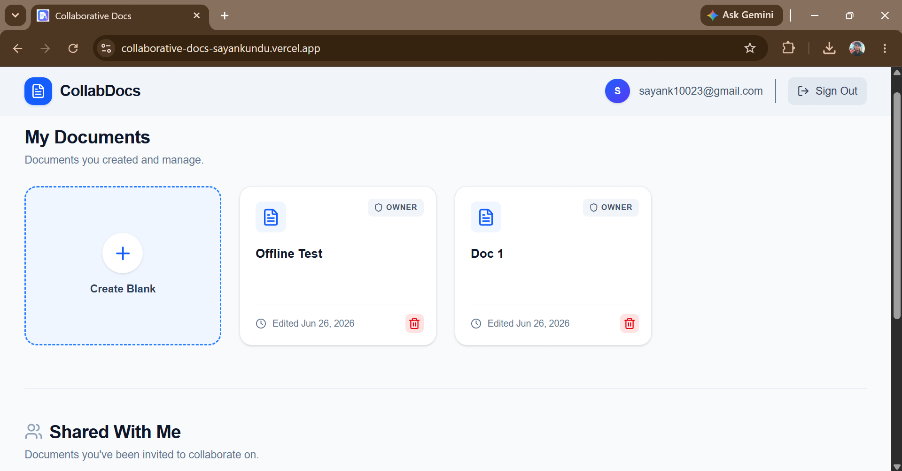
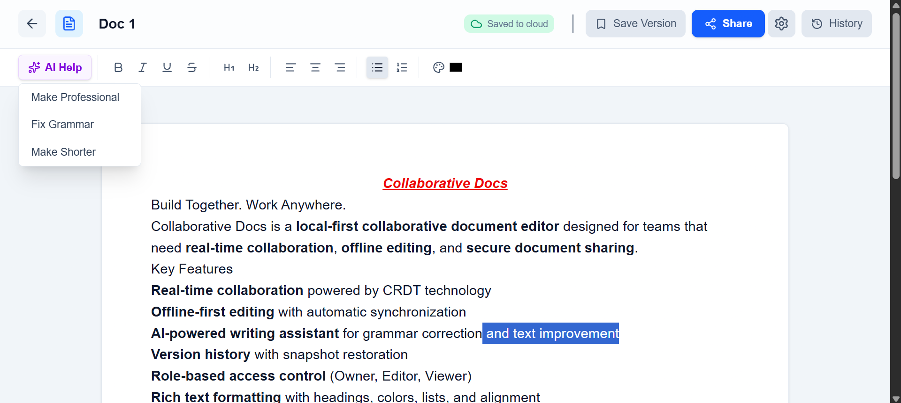

# Collaborative Docs — Local-First Real-Time Document Editor

A sophisticated, highly scalable, and secure **Local-First Collaborative Document Editor** featuring seamless offline capabilities, deterministic real-time conflict resolution, granular version control, and an integrated AI-powered writing assistant. 

This application tackles complex distributed systems engineering challenges—specifically browser-based memory management, state synchronization race conditions, and robust data merging over real-time communication protocols.

---

## 🚀 Live Demo & Submission Details

- **Live Deployment:** [https://collaborative-docs-sayankundu.vercel.app](https://collaborative-docs-sayankundu.vercel.app)
- **GitHub Repository:** [https://github.com/sayank22/collaborative-docs](https://github.com/sayank22/collaborative-docs)

---

## 🛠️ Key Features & Technical Architecture

### 1. Local-First & Offline-First State
* **Zero-Blocking UI:** The client-side storage (`y-indexeddb`) acts as the primary source of truth. Users can open, modify, and close documents instantly without waiting for network requests to complete.
* **Network Interception:** The app intercepts network dropouts (`ERR_INTERNET_DISCONNECTED`) gracefully. It continues tracking local human keystrokes in browser memory, caching modifications until the connection re-establishes.

### 2. Synchronization Loop & Conflict Resolution
* **CRDT Data Merging:** The engine relies on **Yjs (Conflict-free Replicated Data Types)** to merge concurrent edits mathematically. When an offline user reconnects, their accumulated local updates are automatically reconciled with the server state without throwing merge conflicts or overwriting peer data.
* **Real-time Transport:** Real-time data streams over Supabase Realtime WebSocket channels, broadcasting lightweight binary state updates between active browser tabs instantly.

### 3. Versioning & Timeline Restoration
* **State Snapshots:** Users can capture frozen snapshots of the document state and assign them custom names.
* **Non-Destructive Rollbacks:** A history panel fetches past versions from the database, allowing authorized users to restore the document to a prior state without disrupting the real-time cursor positions or editing sessions of other active collaborators.

### 4. Security & Payload Mitigation Strategy
To protect the collaborative real-time engine from malicious actors attempting to crash the infrastructure via Out of Memory (OOM) exploits, this project implements a multi-layered defense strategy:

* **Infrastructure-Level Blocks:** By leveraging Supabase Realtime, incoming WebSocket message payloads are capped at the infrastructure gateway (defaulting to 1MB). This intercepts and blocks massive packet injections before they ever hit the database execution layer.
* **Application-Level Safeguards:** Prior to Hex encoding and transmission, the Next.js client evaluates the raw byte length of the CRDT `Uint8Array` binary vector. Any update exceeding the `1048576` byte threshold is aborted locally, neutralizing data-bloat and bandwidth exhaustion attacks at the perimeter.
* **Tenant Isolation & RBAC:** Enforces strict role rules separating **Owners**, **Editors**, and **Viewers**. PostgreSQL Row Level Security (RLS) policies secure all API routes and direct database updates. The system cross-references the `collaborators` table; unauthenticated inputs or write attempts from users with a 'Viewer' role are rejected natively at the database level.

### 5. Inline AI Writing Assistant
* **Framework Integration:** Powered by the modern `@ai-sdk/react` framework and Google's `gemini-pro` text model via Google AI Studio. 
* **Selection-Aware Prompts:** Highlighting any block of text exposes utility commands directly in the toolbar. The editor captures the specific cursor selection coordinates, transmits the text to a serverless Next.js API route, and streams the incoming tokens natively into the editor instance to handle tasks like **Fix Grammar**, **Shorten**, or **Rewrite Professionally**.

### 6. Real-World Considerations & Production Mitigation
To ensure production readiness, the architecture addresses several inherent distributed system challenges:

* **Handling Document State Growth Over Time:** CRDT state vectors keep a historical log of all deletions and insertions, meaning file metadata footprints naturally grow over time. To combat this, the system is structurally ready for **CRDT State Compaction (Garbage Collection)**, which flattens internal Yjs transaction logs into a singular, optimized baseline snapshot to optimize network payloads and memory profiles.
* **Resilient Error Handling:** Network connections are flaky. The sync system implements an **Exponential Backoff Retry Strategy** on database write-failures. If a save state drops out mid-transmission, the client gracefully holds the data state and steps down requests progressively to prevent server flooding.
* **Production Identity Guardrails:** For local evaluation efficiency, mandatory email confirmations have been temporarily bypassed. However, in a hardened multi-tenant environment, activation flags are handled via secure server-side email validation hooks to eliminate unverified signups and potential account fishing vectors.

---

### 🔮 7. Future Engineering Roadmap
While the application completely fulfills all assignment and distributed system benchmarks, a production-scale roll-out would prioritize the following technical layers:

* **Transactional SMTP Invitations (Nodemailer/Resend):** Currently, collaborator invitations are securely handled via internal database joins and instantly update user-facing dashboards. The next phase will bridge an external transaction handler (like an SMTP gateway or Resend SDK) to dispatch raw email verification hooks containing signed cryptographic hashes for secure token-based workspace onboarding.
* **Asynchronous Deep Cache Architecture (Dexie/IndexedDB):** The present UI layout uses a fast, synchronous `localStorage` mirror loop to serve the document lists instantly during offline drops. While perfect for small metadata trees, scaling to tens of thousands of items would mean migrating the dashboard loop to a background async service worker linked to a custom-indexed browser database (Dexie), complete with pagination pipelines and localized textual search.
* **Offline Conflict Granularity Logs:** While Yjs resolves text clashes deterministically with zero data loss, future releases will integrate a local reconciliation diff viewer. This will give users visual feedback on how their offline edits merged into a peer's changes when resolving network connections.

---


## 🛠️ Tech Stack

- **Frontend/Backend Framework:** Next.js (TypeScript enforced for end-to-end type safety)
- **Collaborative/CRDT Engine:** Yjs, `y-indexeddb`, `@tiptap/extension-collaboration`
- **Rich Text Rich Environment:** TipTap Editor Core (StarterKit, Underline, TextStyle, Color, TextAlign)
- **Database & Realtime Service:** Supabase (PostgreSQL with hard-locked RLS)
- **AI Infrastructure:** Vercel AI SDK & Google Generative AI (`gemini-pro`)
- **Styling UI/UX:** Tailwind CSS & Lucide React

---

## 📂 Project Structure

```text
├── src/
│   ├── app/
│   │   ├── api/ai/route.ts       # Serverless edge endpoint handling Gemini streaming
│   │   ├── editor/[id]/page.tsx  # Optimized TipTap collaborative instance & toolbar UI
│   │   ├── page.tsx              # Global page wrappers    
│   │   └── layout.tsx            # Global layout wrappers
│   ├── hooks/
│   │   └── useDocumentSync.ts    # Core state synchronization and background local-first sync loop
│   ├── lib/
│   │   ├── supabase/client.ts    # Singleton configuration for database & auth clients
│   │   └── sync/versionStore.ts  # Zustand/Global store managing time-travel version histories
│   └── components/               # Share and Access Modals, Footer, and responsive sub-elements

```

---


## Getting Started

1. Clone the repository

```bash
git clone https://github.com/sayank22/collaborative-docs.git
cd collaborative-docs
```

2. Install dependencies

```bash
npm install
```

3. Configure Environment Variables (.env.local)
Create a .env.local file in your root folder and complete your keys:

```bash
NEXT_PUBLIC_SUPABASE_URL="your-supabase-project-url"
NEXT_PUBLIC_SUPABASE_ANON_KEY="your-supabase-anon-key"
GOOGLE_GENERATIVE_AI_API_KEY="your-free-gemini-api-key-from-google-ai-studio"
```

1. Run the Development Server

```bash
npm run dev
```

Open [http://localhost:3000](http://localhost:3000) with your browser to see the result.

---


## Demo

See it live: [https://collaborative-docs-sayankundu.vercel.app](https://collaborative-docs-sayankundu.vercel.app)





---

## Made By - Sayan Kundu

**Full Stack Developer | Proven Engineering Experience at Fintech and EdTech**

---

## 🔗 Links
[](https://drive.google.com/file/d/1c0JPOQJcRBYOldQvooPfd4gQQ0kkJgbq/view?usp=drive_link)
[](https://www.linkedin.com/in/sayan-kundu-70b5442b6/)
[](https://github.com/sayank22)
[](https://sayan-kundu-portfolio.netlify.app)

---
